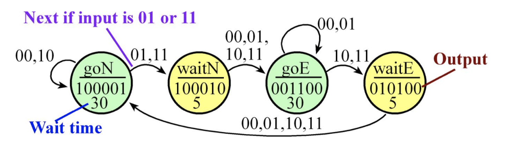

# Traffic Light Simulator

#### Sequence of Operations
- Initialize timer and direction registers
- Specify initial state
- Perform FSM controller
    - Output to traffic lights (depends on the state)
    - Delay (depends on the state)
    - Input from sensors
    - Change states (depends on the inputs and state)

#### State Transition Table
| State # | Name | Lights | Wait Time | In=0 | In=1 | In=2 | In=3 |
| --------|------|--------|-----------|------|------|------|------|
| 0       | goNorth | 100001   | 30   | goNorth | waitNow | goNorth | waitNow |
| 1       | waitNorth | 100010 | 5    | goEast  | goEast  | goEast  | goEast  |
| 2       | goEast | 001100    | 30   | goEast  | goEast  | waitEast| waitEast|
| 3       | waitEast | 010100  | 5    | goNorth | goNorth | goNorth | goNorth |

#### State Transition Graph

**Note:** Image taken from edEx course website
